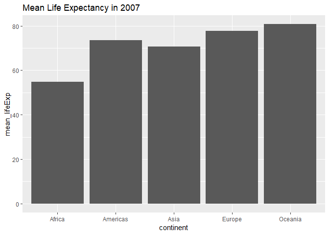
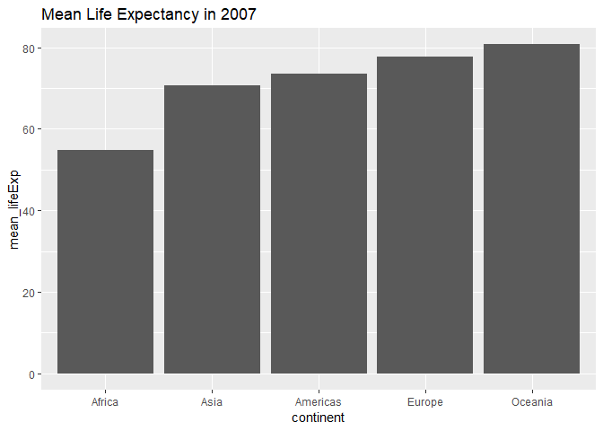
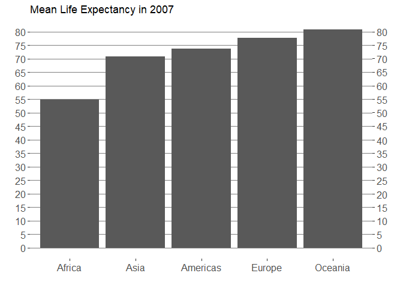
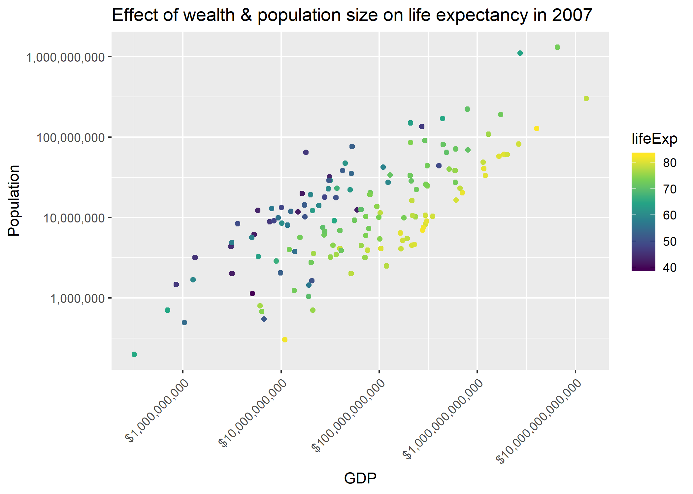

HW05: Factor and figure management
================

-   [Factor management](#factor-management)
    -   [Elaboration for the gapminder data set](#elaboration-for-the-gapminder-data-set)
-   [File I/O](#file-io)
-   [Visualization design](#visualization-design)
-   [Writing figures to file](#writing-figures-to-file)

Factor management
-----------------

With the data set of your choice, after ensuring the variable(s) you’re exploring are indeed factors, you are expected to:

1.  Drop factor / levels;
2.  Reorder levels based on knowledge from data.

#### Elaboration for the gapminder data set

-   *Drop Oceania. Filter the Gapminder data to remove observations associated with the continent of Oceania. Additionally, remove unused factor levels. Provide concrete information on the data before and after removing these rows and Oceania; address the number of rows and the levels of the affected factors.*

First we load all the relevant packages.

``` r
suppressPackageStartupMessages(library(tidyverse))
suppressPackageStartupMessages(library(plotly))
suppressPackageStartupMessages(library(scales))
library(gapminder)
```

Let's just remind ourselves of the structure of the gapminder dataframe.

``` r
str(gapminder)
```

    ## Classes 'tbl_df', 'tbl' and 'data.frame':    1704 obs. of  6 variables:
    ##  $ country  : Factor w/ 142 levels "Afghanistan",..: 1 1 1 1 1 1 1 1 1 1 ...
    ##  $ continent: Factor w/ 5 levels "Africa","Americas",..: 3 3 3 3 3 3 3 3 3 3 ...
    ##  $ year     : int  1952 1957 1962 1967 1972 1977 1982 1987 1992 1997 ...
    ##  $ lifeExp  : num  28.8 30.3 32 34 36.1 ...
    ##  $ pop      : int  8425333 9240934 10267083 11537966 13079460 14880372 12881816 13867957 16317921 22227415 ...
    ##  $ gdpPercap: num  779 821 853 836 740 ...

We see that there are 1704 rows, and the factor continent has 5 levels. What are the corresponding integers associated to each continent?

``` r
#print out a table of continent factors

continents <- gapminder$continent %>% 
  unique()

tibble(Continent = continents, Integer = as.integer(continents)) %>% 
#arrange in increasing integer order
arrange( -desc(Integer)) %>% 

knitr::kable()
```

| Continent |  Integer|
|:----------|--------:|
| Africa    |        1|
| Americas  |        2|
| Asia      |        3|
| Europe    |        4|
| Oceania   |        5|

Now let's remove Oceania, and the unused factor levels:

``` r
#create new tibble with Oceania removed
gap_no <- gapminder %>% 
  filter(continent != "Oceania")

#drop unused factor levels and investigate `gap_no` structure
gap_no %>% 
  droplevels() %>% 
  str()
```

    ## Classes 'tbl_df', 'tbl' and 'data.frame':    1680 obs. of  6 variables:
    ##  $ country  : Factor w/ 140 levels "Afghanistan",..: 1 1 1 1 1 1 1 1 1 1 ...
    ##  $ continent: Factor w/ 4 levels "Africa","Americas",..: 3 3 3 3 3 3 3 3 3 3 ...
    ##  $ year     : int  1952 1957 1962 1967 1972 1977 1982 1987 1992 1997 ...
    ##  $ lifeExp  : num  28.8 30.3 32 34 36.1 ...
    ##  $ pop      : int  8425333 9240934 10267083 11537966 13079460 14880372 12881816 13867957 16317921 22227415 ...
    ##  $ gdpPercap: num  779 821 853 836 740 ...

We see that in the filtered gapminder where we have removed Oceania, and dropped unused levels, there are now 1680 rows with 4 levels for continent, and 140 levels for country. This makes sense because there are two countries (Australia and New Zealand) in continent (Oceania) that we removed.

We can check that the factor levels of the remaining continents are the same:

``` r
continents_no_oceania <- gap_no$continent %>% 
  unique()

tibble(Continent = continents_no_oceania, 
       Integer = as.integer(continents_no_oceania)) %>% 
  arrange( -desc(Integer)) %>% 
  knitr::kable()
```

| Continent |  Integer|
|:----------|--------:|
| Africa    |        1|
| Americas  |        2|
| Asia      |        3|
| Europe    |        4|

Dropping the unused factor levels drops the country factors for Australia and New Zealand. What happens to the remaining country factor levels?

First we find the factor levels for Australia and New Zealand in the unmodified gapminder:

``` r
fct_Oceania <- gapminder %>% 
  select(country) %>% 
  filter(country == "Australia" | country == "New Zealand") %>%
  unique() 


tibble(Country = fct_Oceania$country, Integer = as.integer(fct_Oceania$country)) %>% 
arrange(-desc(Integer)) %>% 
knitr::kable()
```

| Country     |  Integer|
|:------------|--------:|
| Australia   |        6|
| New Zealand |       92|

Now let's see if the integers 9 and 62, after removing Oceania, are reassigned to another country:

``` r
mod <- tibble(Country = gap_no$country, Integer = as.integer(gap_no$country))

mod %>% 
  filter(Integer %in% as.integer(fct_Oceania$country))
```

    ## # A tibble: 0 x 2
    ## # ... with 2 variables: Country <fct>, Integer <int>

We see that the levels 6 and 92 are NOT reassigned to another country after dropping Australia and New Zealand. In other words, if for example, there are levels 1 through 5, and say, level 3 is unused (and subsequently dropped), the remaining levels will be 1,2,4,5 (and not reordered to 1,2,3,4).

-   *Reorder the levels of country or continent. Use the forcats package to change the order of the factor levels, based on a principled summary of one of the quantitative variables. Consider experimenting with a summary statistic beyond the most basic choice of the median.*

We will reorder the continent factors by maximum life expectancy:

``` r
reorder_gap <- gapminder %>% 
  mutate(continent = fct_reorder(continent, lifeExp, max))

tibble(Continent = reorder_gap$continent, 
       Integer = as.integer(reorder_gap$continent)) %>% 
  arrange(-desc(Integer)) %>% 
  unique() %>% 
  knitr::kable()
```

| Continent |  Integer|
|:----------|--------:|
| Africa    |        1|
| Americas  |        2|
| Oceania   |        3|
| Europe    |        4|
| Asia      |        5|

The factors are ordered from least maximum life expectancy, to greatest maximum life expectancy. This is a different order than in the original gapminder dataframe.

-   *Explore the effects of arrange(). Does merely arranging the data have any effect on, say, a figure?*

First we create a suitable data frame:

``` r
#mean life expectancy of each continent in 2007
gap_mean_life_2007 <- gapminder %>% 
  filter(year == 2007) %>% 
  group_by(continent) %>% 
  summarise(mean_lifeExp = mean(lifeExp))

knitr::kable(gap_mean_life_2007)
```

| continent |  mean\_lifeExp|
|:----------|--------------:|
| Africa    |       54.80604|
| Americas  |       73.60812|
| Asia      |       70.72848|
| Europe    |       77.64860|
| Oceania   |       80.71950|

Now we just rearrange according to mean life expectancy and see it's effect on a plot

``` r
 arrange(gap_mean_life_2007, mean_lifeExp) %>% 
  ggplot(aes(continent, mean_lifeExp)) + 
    geom_col() +
    labs(title = "Mean Life Expectancy in 2007" )
```



We see that arrange has no effect on the plot: What we would like is to switch Asia and Americas!

-   *Explore the effects of reordering a factor and factor reordering coupled with arrange(). Especially, what effect does this have on a figure?*

Now, lets reorder factors, but not arrange:

``` r
gap_mean_life_2007 %>%
  mutate(continent = fct_reorder(continent, mean_lifeExp)) %>% 

 
  ggplot(aes(continent, mean_lifeExp)) +
  geom_col() +
  labs(title = "Mean Life Expectancy in 2007" )
```



So it rearranged the factors in the increasing order for plotting! Note however, that factor reordering does NOT change the order of the rows in the data.frame:

``` r
gap_mean_life_2007 %>%
  mutate(continent = fct_reorder(continent, mean_lifeExp)) %>% 
 knitr::kable()
```

| continent |  mean\_lifeExp|
|:----------|--------------:|
| Africa    |       54.80604|
| Americas  |       73.60812|
| Asia      |       70.72848|
| Europe    |       77.64860|
| Oceania   |       80.71950|

Factor reordering + arrange: This will reorder the factors, AND the rows of the data.frame.

File I/O
--------

Experiment with one or more of write\_csv()/read\_csv() (and/or TSV friends), saveRDS()/readRDS(), dput()/dget(). Create something new, probably by filtering or grouped-summarization of Singer or Gapminder. I highly recommend you fiddle with the factor levels, i.e. make them non-alphabetical (see previous section). Explore whether this survives the round trip of writing to file then reading back in.

Let's reorder the continent factors of gapminder by mean life expectancy of each continent, and write it to file, read it back in, and display a table of the output:

``` r
gapminder %>% 
  group_by(continent) %>% 
  summarise(mean_lifeExp = mean(lifeExp)) %>% 
  mutate(continent = fct_reorder(continent, mean_lifeExp)) %>% 
  write_csv("mean_life.csv")

gap_test <- read_csv("mean_life.csv")
```

    ## Parsed with column specification:
    ## cols(
    ##   continent = col_character(),
    ##   mean_lifeExp = col_double()
    ## )

``` r
tibble(Continent = gap_test$continent, Integer = as.integer(gap_test$continent)) %>% 
  knitr::kable()
```

    ## Warning in eval_tidy(xs[[i]], unique_output): NAs introduced by coercion

| Continent |  Integer|
|:----------|--------:|
| Africa    |       NA|
| Americas  |       NA|
| Asia      |       NA|
| Europe    |       NA|
| Oceania   |       NA|

So the factors are interpreted as characters when we read it back in. To verify we have:

``` r
is.character(gap_test$continent)
```

    ## [1] TRUE

Visualization design
--------------------

Remake at least one figure or create a new one, in light of something you learned in the recent class meetings about visualization design and color. Maybe juxtapose your first attempt and what you obtained after some time spent working on it. Reflect on the differences. If using Gapminder, you can use the country or continent color scheme that ships with Gapminder. Consult the dimensions listed in All the Graph Things.

Let's look at improving the design of previous bar plot graph of mean life expectancy of each continent:

``` r
gap_mean_life_2007 %>% 
  mutate(continent = fct_reorder(continent, mean_lifeExp)) %>% 
  ggplot(aes(continent, mean_lifeExp)) +
  geom_col() +
  
  #remove x and y labels because it is unnecessary clutter
  labs(title = "Mean Life Expectancy in 2007", x = "", y = "")+
  
 #add ticks every 5 years and duplicate on the right-hand side
  scale_y_continuous(breaks=5*(0:20), sec.axis = dup_axis()) + 
  theme_grey() +
  theme(axis.text = element_text(size = 12)) +
  
  # Put gridlines behind data
  theme(
   panel.background = element_rect(fill = NA),
   panel.grid.major.y = element_line(colour = "grey50"), 
   panel.grid.major.x = element_blank()
  )
```



Then, make a new graph by converting this visual (or another, if you’d like) to a plotly graph. What are some things that plotly makes possible, that are not possible with a regular ggplot2 graph?

Let's make another plot of population and GDP of each country in 2007, coloured by life expectancy (see next section for it's output).

``` r
gap_filtered <- gapminder %>%
  filter(year == 2007) %>% 
  mutate(GDP = gdpPercap * pop)


gdp_pop_lifeExp <- ggplot(gap_filtered, aes(GDP, pop)) +
    geom_point(aes(colour=lifeExp)) + 
    scale_x_log10(labels= dollar_format(), breaks = 10^((1:20)) ) +
    scale_y_log10(labels = comma_format()) +
    scale_colour_viridis_c() +
    theme(axis.text.x = element_text(angle = 45, hjust = 1)) +
    labs(title = "Effect of wealth & population size on life expectancy in 2007", 
         x = "GDP", 
         y = "Population"
         )
```

Finally, make a plotly out of this plot:

``` r
#this code chunk is commented out since there are problems with knitting as a github document
#ggplotly(gdp_pop_lifeExp)
```

We have many more interactivity options with plotly; for instance, zooming in on different parts of the graph, or investigating the exact values of each data point.

Writing figures to file
-----------------------

Use ggsave() to explicitly save a plot to file. Then use `` to load and embed it in your report. You can play around with various options, such as:

-   Arguments of ggsave(), such as width, height, resolution or text scaling.
-   Various graphics devices, e.g. a vector vs. raster format.
-   Explicit provision of the plot object p via ggsave(..., plot = p). Show a situation in which this actually matters.

``` r
ggsave("my_plot.png", plot = gdp_pop_lifeExp) 
```

    ## Saving 7 x 5 in image

Here is the plot! 
